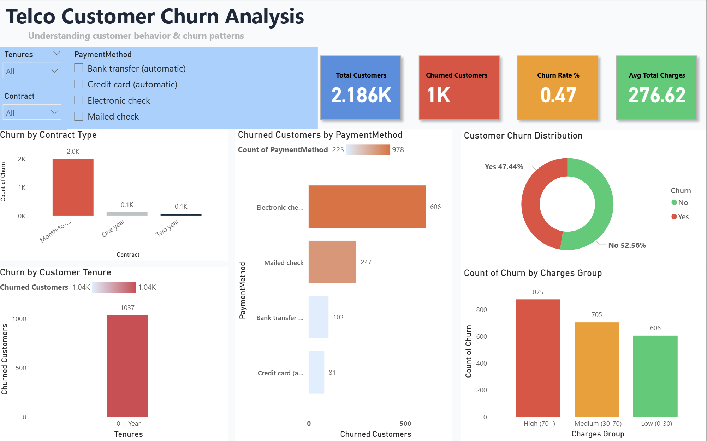

# 📊 Telco Customer Churn Analysis

## 📌 Overview
This project focuses on analyzing customer churn in the telecom industry using machine learning and business intelligence techniques. The objective is to identify key factors influencing churn and provide actionable insights to improve customer retention.

---

## 🛠️ Tools & Technologies
- Python (Pandas, NumPy, Matplotlib, Seaborn)
- Machine Learning (Logistic Regression, Random Forest)
- Power BI
- Statistics

---

## 🔄 Project Workflow
1. Data Loading  
2. Exploratory Data Analysis (EDA)  
3. Data Cleaning & Preprocessing  
4. Feature Engineering  
5. Encoding Categorical Variables  
6. Train-Test Split  
7. Model Building (Logistic Regression & Random Forest)  
8. Model Evaluation  
9. Feature Importance Analysis  
10. Dashboard Creation (Power BI)  
11. Business Insights  

---

## 📊 Dataset
IBM Telco Customer Churn Dataset containing customer demographics, services, tenure, contract type, and billing information.

---

## 🤖 Model Performance
- Random Forest Accuracy: ~78%  
- Logistic Regression Accuracy: ~73%  
- Logistic Regression Recall: 0.79 (better at identifying churn customers)  

---

## 📈 Key Insights
- Customers with month-to-month contracts have higher churn rates  
- Customers with shorter tenure are more likely to leave  
- Higher monthly charges significantly increase churn probability  

---

## 📊 Power BI Dashboard
The Power BI dashboard provides an interactive visualization of:
- Customer churn distribution  
- Churn by contract type and tenure  
- Payment method analysis  
- Customer segmentation  

### 🔹 Dashboard Overview

### 🔹 KPI metrics

### 🔹 Trend Analysis

## 🚀 Project Highlights
- Combined machine learning with business intelligence  
- Compared models based on accuracy and recall  
- Identified key churn drivers for decision-making  
- Developed interactive dashboard for stakeholders  

---

## 💡 Business Impact
This project helps telecom companies identify high-risk customers and take proactive measures such as retention strategies, personalized offers, and service improvements to reduce churn.
